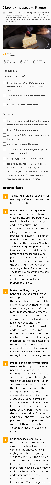

<!-- Please update value in the {}  -->

<h1 align="center">recipe page</h1>

   Solution for a challenge from  <a href="http://devchallenges.io" target="_blank">Devchallenges.io</a>.

  <h3>
    <a href="https://Dorecipe.surge.sh">
      Demo
    </a>
     | 
    <a href="https://github.com/HIIfeanyichukwu/recipe-page">
      Solution
    </a>
     | 
    <a href="https://{your-url-to-the-challenge}">
      Challenge
    </a>
  </h3>

<!-- TABLE OF CONTENTS -->

## Table of Contents

- [Overview](#overview)
  - [Built With](#built-with)
- [Features](#features)
- [Contact](#contact)
- [Acknowledgements](#acknowledgements)

<!-- OVERVIEW -->

## Overview

- Where can I see your demo?
  - [demo](https://Dorecipe.surge.sh)
- What was your experience?
  - using labels to structure checkboxes
- What have you learned/improved?
  - learned how to structure html checkboxes well.
- Your wisdom? :)
  - too many resources ? start small. a journey of a thousand miles begins with a step.

### Built With

- HTML
- CSS

## Features

This application/site was created as a submission to a [DevChallenges](https://devchallenges.io/challenges) challenge. The [challenge](https://devchallenges.io/challenges/TtUjDt19eIHxNQ4n5jps) was to build an application to complete the following user stories:

## User Stories
- [x] I can see the recipe with ingredients and instructions
- [x] I can select checkbox if i have the ingredients
- [x] I can see the number of servings, baking times

## Acknowledgements

- [Steps to replicate a design with only HTML and CSS](https://devchallenges-blogs.web.app/how-to-replicate-design/)
- [Node.js](https://nodejs.org/)
- [Marked - a markdown parser](https://github.com/chjj/marked)

## Contact

- GitHub [@DoIfeanyichukwu](https://github.com/doifeanyichukwu)
- Twitter [@DoIfeanyichukwu](https://twitter.com/DoIfeanyichukwu)
